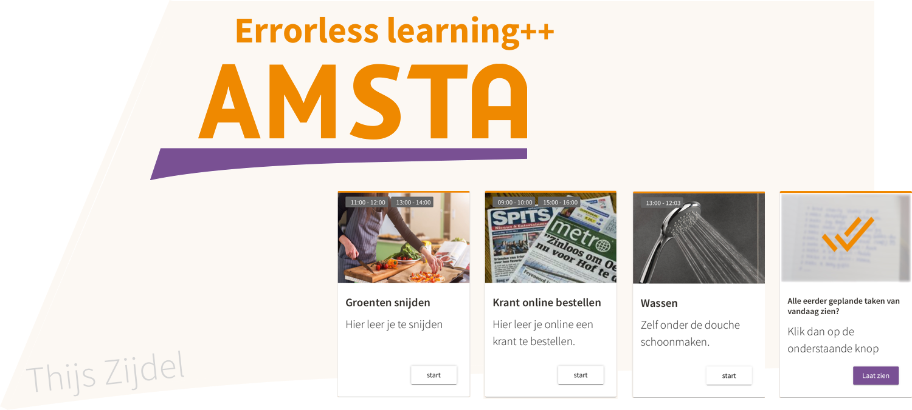

# Amsta
HvA Project PAD - AMS5 - Group 5

Web Application for the company Amsta Amsterdam.



## Getting Started

To see the application there are some things that needs to be configured before running it.
So please follow to following document or read /doc/manual.pdf

Note: we didn't received a requirement from Corendon to make it a runable jar and add a config file.


### Prerequisites

Install a Java IDE to build and run the application

```
We used Netbeans to build it. See [Built with] for the link
```

Install and configure an SQL host.

```
We used SQL Workbench's local host to run our database
```


### Installing
When you have an SQL Host and IDE installed (prefered Netbeans) u can follow these steps:

Step 1) Creating the database.

```
Run the CreateDB.sql file in your sql host.
```

Step 2) Configuring the connection.

```
Go to the MainApp.java (in /app/..) and edit line: 50

Keep the first  parameter the same. 
Change the second parameter to your SQL userName.
Change the third  parameter to your SQL userPassword.
```


Step 3) Run the application.

```
For getting the user passwords see: /doc/manual.pdf 
```


### More information

See: /doc/manual.pdf 
For the entire installation and configuring process and a full manual of the application.


### Development
Before developing the application you'll need some things installed.

The easiest way of installing the needed libaries, compilers etc etc is by node.js package manager. Download link:
[Node.js](https://nodejs.org/en/) 

>(Link to [npm](https://www.npmjs.com)) for documentation


Than you will need to install [Angular Cli](https://github.com/angular/angular-cli).
 > See the readme for install process 
 
 > Note: it IS NOT needed to create a new Project !

After you have installed angular Cli you're almost done.

Get this repository to your local drive (preferred with git access)

And type the following command:

```text
  cd ROUTE_TO_YOUR/Amsta
  ng serve --open
```

Now the application is running and you can start developing.


### Usage
Currently the application isn't public available.


## Built with 
* [HTML 5](https://www.w3schools.com/html/) - To get some basic markup and text done
* [CSS 3](https://www.w3schools.com/css/) - So the html markup has some styling
* [Bootstrap 4](https://v4-alpha.getbootstrap.com) - So we don't have to reinvent the 'css' wheel 100*
* [JavaScript](https://www.javascript.com) - For getting some interaction on the web app
* [TypeScript](https://www.typescriptlang.org/index.html) - For bringing the OOP principals to javascript 
* [Angular](https://angular.io) - JavaScript Framework to let our web app really rock! 
* [MySQL / PHPmyAdmin](https://www.mysql.com/) - For the database 
* [IntelliJ Idea](https://www.jetbrains.com/idea/) - In what we developed the (start) application.

# Dependencies/ Libraries 
* [JFoenix](http://www.jfoenix.com/) - For the material design in the application
* [SQL Connector](http://www.jfoenix.com/) - For the connection to the database (MYJbdc)


## Built By

* **Thijs Zijdel** 


## Project Files
- app/LostLuggage			(folder for application)
	- /paths/ 				(for info, send me a message)				

- data 						(folder for db dummy data)
	- CreateDB.sql 			(sql create dummy database query)


- doc 						(folder for documentation)
	- Manual.pdf 			(full manual, inc. installation)
  	- Poster.png  			(for giving an impression of the app)
   	- Responsibilities.pdf 	(responsibilities for each author)
		


## License

This project is licensed under the MIT License - look at [LICENSE.md](LICENSE.md) file for details.
